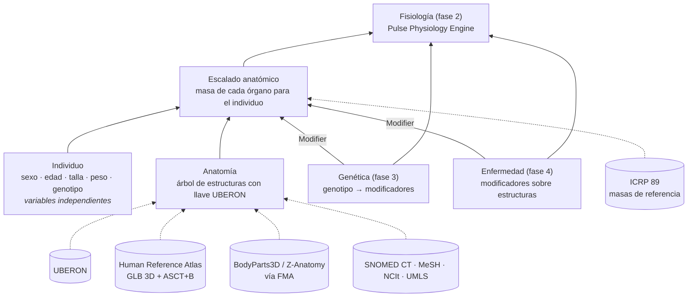

# Arquitectura

## Capas



## Principios

1. **Las variables independientes nunca se derivan entre sí.** `Person` guarda
   solo sexo, edad, talla, peso, grasa corporal (opcional) y genotipo. El IMC,
   la masa libre de grasa o la masa de un órgano se calculan cada vez, así que
   no pueden quedar desactualizados. Para estudiar una sola variable se usa
   `dataclasses.replace(persona, weight_kg=...)`.

   Las únicas restricciones conjuntas exigen que la combinación sea compatible
   con la vida:
   - IMC de al menos 13 en hombres y 11 en mujeres (Henry 1990);
   - si la grasa es medida, masa libre de grasa por m² de al menos ese IMC
     mínimo × (1 − grasa esencial: 3 % en hombres, 12 % en mujeres).

2. **Una sola llave por estructura: UBERON.** Se eligió UBERON por tres motivos:
   - es abierta (CC BY 3.0) y se publica cada mes;
   - la usan el Human Reference Atlas, Monarch, el Human Cell Atlas y las bases
     de expresión génica;
   - cada término trae referencias cruzadas a FMA (BodyParts3D, Z-Anatomy),
     SNOMED CT (historia clínica), MeSH (literatura), NCIt (oncología) y UMLS.

   Cualquier recurso que hable de "hígado" en cualquiera de esos sistemas se
   puede enlazar con `Anatomy.find_xref`.

3. **Lo curado y lo generado van en archivos distintos.**
   - `structures.json` lo mantiene una persona: qué estructuras modelamos, su
     nombre en español y su agrupación en sistemas.
   - `uberon_snapshot.json` lo produce `bodysim.sources.uberon` a partir de un
     release concreto de UBERON. Al actualizar el release, el diff muestra
     exactamente qué cambió en la ontología.

4. **El simulador funciona sin conexión.** Las fuentes externas se leen una vez
   y se congelan en `data/`. Las pruebas no dependen de la red.

5. **Cada valor cuantitativo lleva su procedencia y su estado de verificación.**
   La trazabilidad del dato es la base para defender la credibilidad de un
   modelo computacional en salud (por ejemplo, ante ASME V&V 40 / FDA).

## Árbol del modelo y grafo de UBERON

En UBERON las relaciones `part_of` e `is_a` forman un grafo con múltiples
padres. Por ejemplo, el corazón es `part_of` "heart plus pericardium". El
simulador usa un árbol más simple, cuerpo → sistema → órgano o tejido, definido
en `structures.json`. Las relaciones originales de UBERON se conservan en
`Structure.uberon_part_of`.

Las estructuras pares (riñones, pulmones, suprarrenales, gónadas, mamas) se
modelan como el par completo (`bilateral: true`). Sus modelos 3D laterales
("left kidney", "right kidney") se recogen desde las subclases de UBERON.

## Escalado de masas (fase 1)

```text
masa = masa_ref(ICRP 89, sexo) × (X_individuo / X_referencia) ** b × Π factores de los Modifier
```

| Base X | Estructuras | Ecuación |
|---|---|---|
| Masa libre de grasa | órganos y tejidos magros (por defecto) | peso × (1 − grasa medida), o Janmahasatian 2005 si no se midió |
| Masa grasa | tejido adiposo, mama | peso − masa libre de grasa |
| Volumen sanguíneo | sangre | Nadler 1962 |
| Constante | encéfalo, médula espinal | — |

La persona de referencia de cada sexo (176 cm y 73 kg; 163 cm y 60 kg) recupera
exactamente las masas de ICRP 89. Hay una prueba que lo garantiza.

Limitaciones conocidas:

- Los exponentes son `b = 1` (isometría). Falta calibrarlos con datos de
  autopsia o de imagen.
- Solo cubre adultos. Para la edad pediátrica harán falta las referencias por
  edad de ICRP 89.
- Algunas masas de ICRP incluyen la sangre contenida (pulmones). Por eso la
  "masa no asignada" del informe es aproximada.

## Grasa corporal y peso

El peso es una entrada, pero no se reparte por igual: lo que más varía entre
personas de la misma talla es la grasa. El modelo lo trata así:

1. **Grasa medida.** Si el individuo trae su fracción de grasa
   (`body_fat_fraction`, de DXA, bioimpedancia o pliegues), la masa grasa es
   peso × fracción y el resto es masa libre de grasa.
2. **Grasa estimada.** Si no, la masa libre de grasa se estima desde sexo,
   talla y peso con Janmahasatian 2005. Así, dos personas con igual talla y peso
   tienen la misma composición.
3. **Reparto.** El tejido adiposo y la mama escalan con la masa grasa. El resto
   de órganos magros escala con la masa libre de grasa. El encéfalo no cambia.

Ejemplo con la grasa estimada: una mujer de 163 cm pasa de 60 a 95 kg. De los
35 kg ganados, 23,6 kg (67 %) son grasa y 11,4 kg (33 %) masa libre de grasa.
Es coherente con la regla de Forbes (Hall 2007): cuanta más grasa tiene una
persona, mayor es la proporción de grasa en el peso que gana.

Limitaciones, en orden de importancia para simular enfermedad:

- **Distribución de la grasa.** Hay un único compartimento de tejido adiposo.
  No distingue grasa subcutánea, visceral ni ectópica (hígado, epicardio,
  páncreas, músculo), que es la que más pesa en el riesgo metabólico y
  cardiovascular.
- **Reparto de la masa magra.** La masa libre de grasa extra se reparte en
  proporción a todos los órganos magros. Ejemplo: un hombre de 180 cm y 90 kg
  con 12 % de grasa frente a otro con 35 %. El primero obtiene más músculo,
  como corresponde, pero también un hígado y un esqueleto un 35 % mayores, lo
  que no es realista. Además, parte de la masa magra ganada en la obesidad es
  agua y proteína del propio tejido adiposo.
- **Estimación de la grasa.** La ecuación no tiene en cuenta la edad ni el
  origen étnico.
- **Volumen sanguíneo.** Nadler depende solo de talla y peso. Con el mismo
  peso, el atleta y la persona sedentaria tienen la misma volemia, aunque la
  sangre se relaciona más con la masa magra.

## Puntos de extensión

- **`Modifier(structure_id, mass_factor, origin)`.** Es la interfaz por la que
  la genética y la enfermedad actuarán sobre la anatomía sin tocar las variables
  del individuo. Por ejemplo, una esteatosis hepática sería un `Modifier` sobre
  `UBERON:0002107`. Hoy solo afecta a la masa; en fase 2 se ampliará a
  parámetros fisiológicos.
- **Nuevas estructuras.** Para añadir una:
  1. Agrégala a `structures.json` con su CURIE de UBERON.
  2. Ejecuta `python -m bodysim.sources.uberon`.
  3. Si tiene masa de referencia, añádela a `icrp89_reference.json` con su
     estado de verificación.

## Fuentes y licencias

Antes de cualquier uso comercial, hay que revisar la licencia vigente de cada
fuente.

| Fuente | Qué aporta | Licencia | Implicación |
|---|---|---|---|
| UBERON | ids, nombres, definiciones, relaciones, referencias cruzadas | CC BY 3.0 | Uso libre con atribución |
| Human Reference Atlas (HuBMAP) | órganos 3D (GLB), tablas ASCT+B | CC BY 4.0 | Uso libre con atribución |
| BodyParts3D | mallas de todo el cuerpo, indexadas por FMA | CC BY-SA 2.1 JP | Las mallas derivadas heredan la licencia (share-alike) |
| Z-Anatomy | atlas 3D completo basado en BodyParts3D | CC BY-SA 4.0 | Igual que BodyParts3D |
| ICRP 89 / 110 / 145 | valores de referencia y fantomas computacionales | publicaciones de ICRP | Los valores se pueden citar; los fantomas, según los términos de ICRP |
| Pulse Physiology Engine | fisiología integrada de cuerpo completo | Apache 2.0 | Compatible con producto comercial |
| Anny (NAVER LABS) | forma corporal paramétrica por edad, talla y peso | Apache 2.0 | Compatible con producto comercial |
| SMPL / SMPL-X | forma corporal paramétrica | no comercial (comercial vía Meshcapade) | Evitar en producto sin licencia |
| SNOMED CT | terminología clínica | licencia de SNOMED International o del país miembro | Las referencias cruzadas son públicas; el contenido completo requiere licencia |

## Fases siguientes

**Fase 2: fisiología.** Integrar Pulse por su API de Python:

- `Person` se traduce en un `SEPatient` (sexo, edad, talla, peso y fracción de
  grasa, esta última calculada con `anthropometry`);
- los compartimentos de Pulse se asignan a nodos UBERON;
- las masas escaladas se usan como volúmenes iniciales donde Pulse lo permita.

**Fase 3: genética.**

- Las tablas ASCT+B del HRA dicen qué genes y biomarcadores caracterizan cada
  estructura.
- ClinVar y GWAS/PGS Catalog dan la asociación entre variante y fenotipo.
- HPO/Monarch relacionan fenotipo, anatomía (UBERON) y enfermedad (MONDO).
- La salida de esta capa son `Modifier`, nunca cambios en `Person`.

**Fase 4: enfermedad.** Una enfermedad es una regla que produce modificadores
anatómicos y fisiológicos sobre nodos UBERON. Su causa puede ser:

- **externa:** trauma, tóxicos, infección, dieta;
- **genética:** variantes del genotipo;
- **mixta:** combinación de ambas.

Se enlaza con SNOMED CT y MONDO mediante las referencias cruzadas de cada
estructura.
